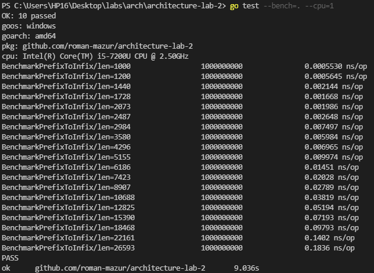
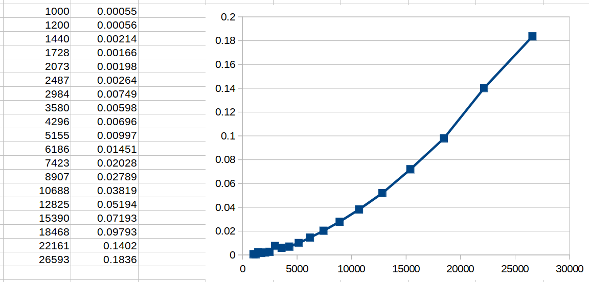
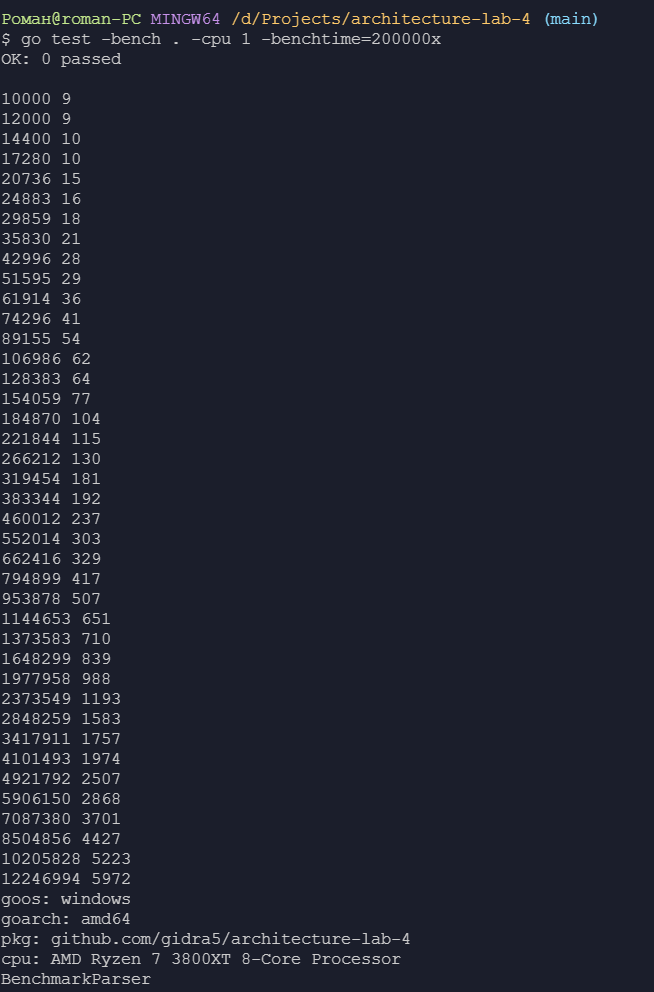
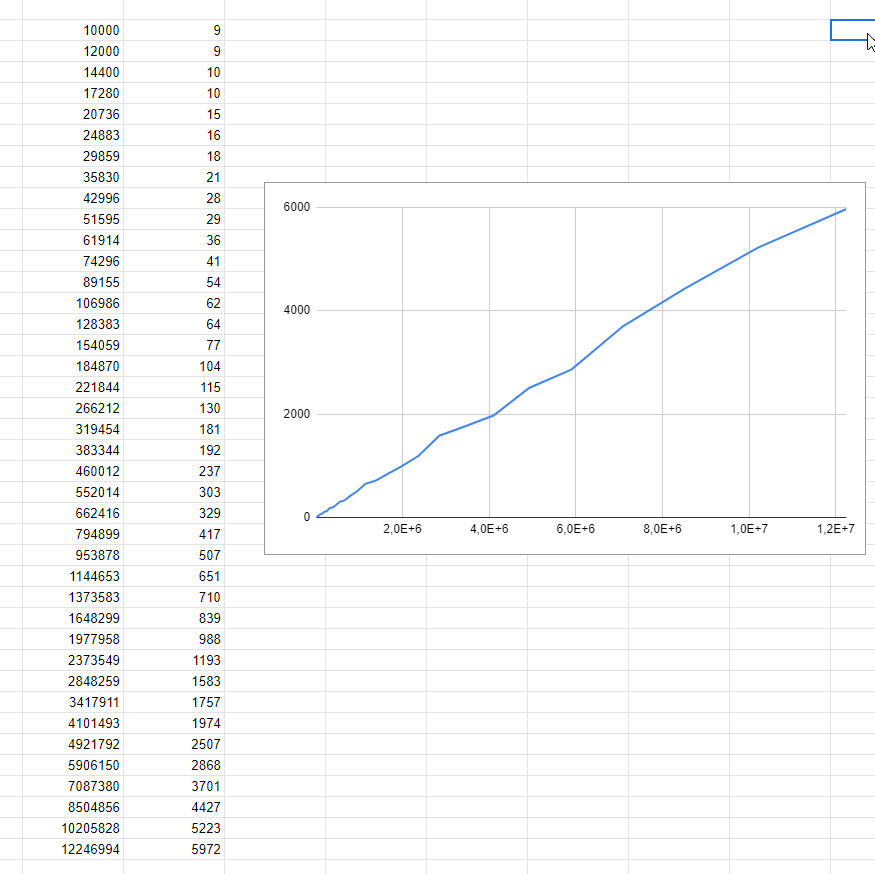
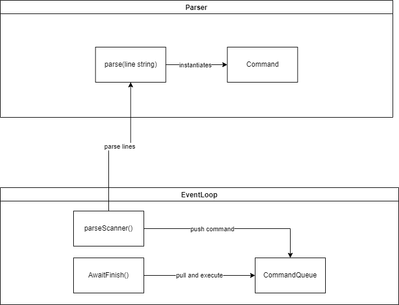

# Звіт #
## Завдання 1 ##
### Текст завдання: ###
*Для 2-гої роботи, підтвердьте лінійний час виконання вашої функції перетворення
чи обчислення вхідного виразу.*  
### Виконання: ###  

```
var cntRes string

func BenchmarkPrefixToInfix(b *testing.B) {
	var l = 1000
	for i := 1; i < 20; i++ {
		var s = strings.Repeat("+ ", l)
		s += strings.Repeat("2 ", l)
		s += "2"

		b.Run(fmt.Sprintf("len=%d", l), func(b *testing.B) {
			cntRes, _ = PrefixToInfix(s)
		})

		l = int(float32(l) * 1.2)
	}
}
```




  

Час росте пропорційно довжині строки, а графік нагадує пряму. Робимо висновок, що час виконання функції є лінійним.  


## Завдання 2 ##
### Текст завдання: ###
*Для 3-тої роботи, побудуйте діаграму взаємодії компонентів у вашій
імплементації.
### Виконання: ###  
Зображено компоненти Форум, Користувач та Інтереси, а також зв'язок користувача з форумом через інтерес. 

Діаграма взаємодії користувача та системи з 3 лабораторної роботи:  


Діаграма містить три сутності:
- Client
- Server
- Database

Етапи взаємодії:
1. Користувач використовуючи інтерфейс тригерить http-запит до сервера.
2. Запит приходить на сервер
3. Сервер виконуэ відповідно до команди запит до бази даних
4. База даних повертає результат операції
5. Сервер повертає результат клієнту
6. Клієнт виводить результат операції на екран

## Завдання 3 ##
### Текст завдання: ###
*Для 4-ої роботи, побудуйте діаграму взаємодії для вашої реалізації (на ній, скоріш
за все, мають опинитися компоненти парсера, черги команд, ядра цикла) та
підтвердьте лінійний час роботи вашого парсера команд.*
### Виконання: ###  
Для підтвердження лінійного часу виконання ми розробили бенчмарк який запускає парсер зі зростаючим обємом даних та вимірює час витрачений на парсинг. Як дані для парсингу на кожній ітерації ми створювали
строку команд, збільшуючи кількість команд на певний крок (10000) на кожній ітерації. Окремо винесли змінну, куди зберігаємо результати парсера, щоб наші виклики не були оптимізовані. Бенчмарки запускалися на одному ядрі процесора, щоб точно вимірятии час виконання. Збільшуючи на однакову кількість однакових команд нашу строку ми зможемо простежити настільки більше часу потрібно парсеру для обробки. Ми повинні довести що цей час є лінійним, тож зробимо 40 ітерацій та побудуємо графік за знайденими точками. Нажаль метод `b.Run()` не виводить час виконання якщо він занадто малий, тому вимір часу виконувався вручну використовуючи модуль `time`, результат выводився на экран у форматі `*довжина* *час у мілісекундах*`. Навіть виконуючи подібні бенчмарки в лабараторних умовах, в нас все ж працює операційна система й існує купа фонових процесів що так чи інакше впливають на час виконання, тож графік не може бути абсолютно лінійним, але він повинен бути дуже схожий.

```
func BenchmarkParser(b *testing.B) {
	delta := 10000
	x := "add 1 1\nprint 1\n"
	var l = delta
	s := strings.Repeat(x, delta)

	println()
	for i := 1; i <= 40; i++ {
		eventLoop := new(EventLoop)
		eventLoop.Start()
		s += strings.Repeat(x, delta)

		scanner := bufio.NewScanner(strings.NewReader(s))

		start := time.Now()
		eventLoop.parseScanner(scanner)
		end := time.Now()
		println(l, end.Sub(start)/time.Millisecond)

		delta = int(float32(l) * 0.2)
		l = int(float32(l) * 1.2)
	}
}
```




Другою частиною завдання було створити діаграму взаємодії, де ми визначили ключові сутності нашої системи та яким чином вони взаємодіють між собою. В даному випадку ми виокремили також 2 інтерфейси - Handler та Command та дві сутності - Parser та EventLoop. 

